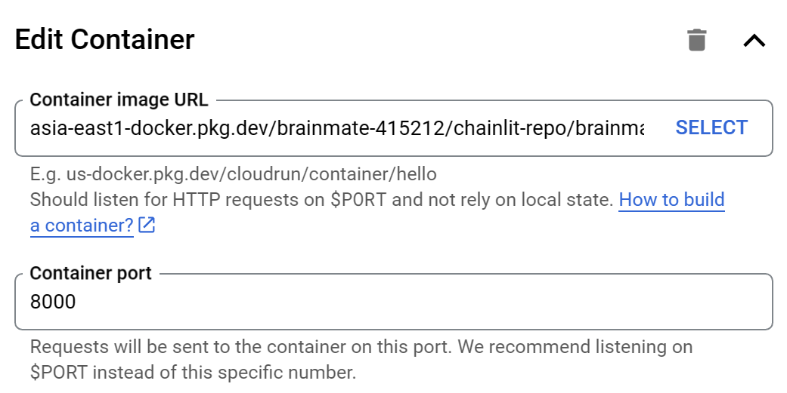
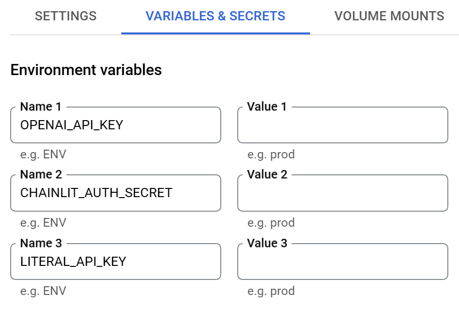

## How to use this repo

1. Clone this repo

   ```bash
   git clone https://github.com/princesswinnie1122/BrainMate.git
   ```

2. Add an `.env` file that includes: 

   ```bash
   OPENAI_API_KEY=
   CHAINLIT_AUTH_SECRET=
   LITERAL_API_KEY=
   GOOGLE_APPLICATION_CREDENTIALS=/chainlit-gcp/vision.json
   ```

   - `OPENAI_API_KEY`：get an API key [here](https://platform.openai.com/docs/overview)
   - `CHAINLIT_AUTH_SECRET`：generate with `chainlit create-secret`
   - `LITERAL_API_KEY`：follow [this instruction](https://docs.chainlit.io/data-persistence/overview)

3. Modify the <names> in the below commands yourself.

### Run locally

1. Install dependencies

   ```bash
   pip install --no-cache-dir -r requirements.txt
   ```

2. Run the app in root directory (contains `app.py`)

   ```bash
   chainlit run app.py -w
   ```

   Your app should now be accessible at [http://localhost:8000](http://localhost:8000/).

### Run with Docker

1. Put all folders and files in another folder (container)

2. Build docker image (in the container)

   ```bash
   docker build -t brainmate .
   ```

3. Test running it locally

   ```bash
   docker run -p 8000:8000 `
     --env-file .env `
     --name chainlit-gcp-container `
     brainmate
   ```

   Your app should now be accessible at [http://localhost:8000](http://localhost:8000/).

### Deploy to Google Cloud Run

1. Set up your GCP project and service account with gcloud CLI

2. Tag the image

   ```bash
   docker tag brainmate:latest asia-east1-docker.pkg.dev/brainmate-415212/chainlit-repo/brainmate:latest
   ```

3. Push the image

   ```
   docker push asia-east1-docker.pkg.dev/brainmate-415212/chainlit-repo/brainmate:latest
   ```

4. Create a new service, then enter the image URL and edit the container based on your needs

   

5. Remember to add the environment variables in `.env`

   

6. Your app should be ready after deployment!

   
